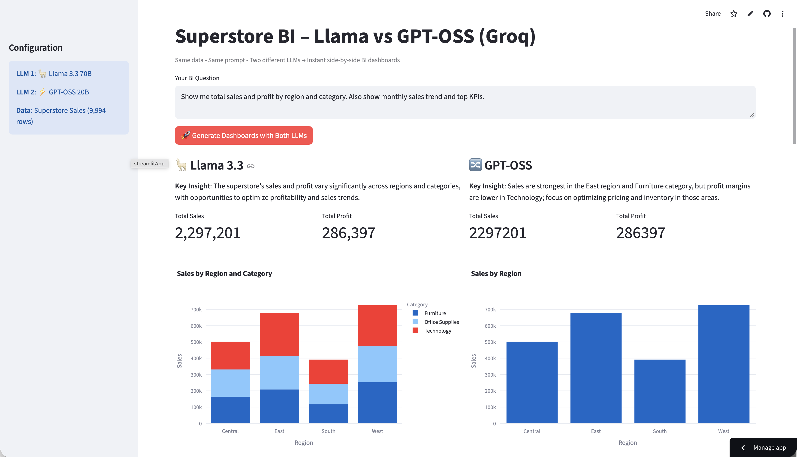

# Superstore BI LLM Showdown

**Side-by-side BI dashboards** — Two Groq LLMs get the **exact same data, metadata and prompt**.  
See how different models reason and visualize in real time.



### Live Demo
[](https://your-app-name.streamlit.app)  
*(Replace with your actual link after deployment)*

### Features
- Two LLMs running in parallel (`llama-3.3-70b-versatile` vs `openai/gpt-oss-20b`)
- Real Superstore Sales dataset (9,994 rows)
- Real totals injected → zero hallucination on KPIs
- Beautiful Plotly dashboards (bar, line, pie, etc.)
- Fully secure — API key never exposed

### Tech Stack
- Streamlit
- Groq (free tier)
- OpenAI Python SDK
- Pandas + Plotly

### Run Locally
```bash
git clone https://github.com/yourusername/superstore-bi-llm-showdown.git
cd superstore-bi-llm-showdown
pip install -r requirements.txt
cp .env.example .env
# Add your GROQ_API_KEY
streamlit run app.py

